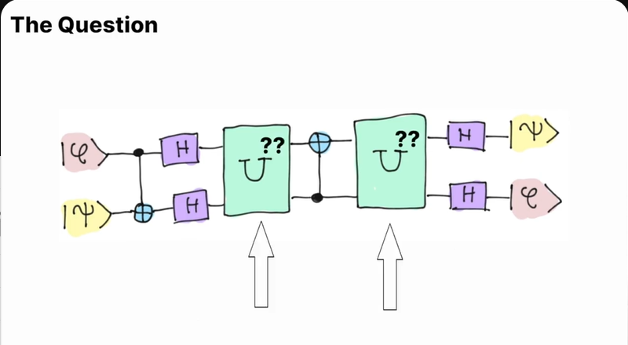

# Intro
Step-by-step solution to the Pennylane Code Camp challenge question covered in [Quantum Programming Job Interview Q&A | PennyLane Tutorial](https://www.youtube.com/watch?v=6fM8FatYWt8) video.

### Contents of the repo:

#### README.md
Summary of the solution derivation

#### `solve_pennylane.ipynb`
Notebook for obtaining explictit form of `U` matrix

#### `find_matrix_form_example.pdf` 
PDF of notes showing explicit example of how to derive the matrix form of parallel Hadamard gates in 2-qubit basis

# The question:
Solve for the gate operation `U` such that the whole algorithm depicted in the picture below is equivalent to a SWAP gate.



In the video, Guillermo presents two methods to solve this. The first, covered briefly, is via machine learning: rewrite `U` as a series of several parameter-dependent parts, then minimize the loss function (SWAP gate minus our current algorithm guess) with respect to the parameter values. The second method, explained in more detail, is via compilation, using clever substitutions and the fact that the SWAP gate can be decomposed into simpler parts. 

Here I present a slightly different way of explaining the latter method. Although it is less elegant than the video, it doesn't require knowing the SWAP decomposition and requires less cleverness in its (one) substitution.

# The solution:
We can write out the representation of the problem like this:

$$A B U C U B = S$$

where $A$ is the CNOT gate (qubit 1 control), $B$ is the parallel Hadamard gates, $U$ is our gate to solve for, $C$ is a CNOT (qubit 2 control), $S$ is the SWAP gate.

Now the problem boils down to isolating $U$ on the left hand side. We will take heavy advantage of the fact that these are all unitary matrices, so $A A^{-1} = A^{-1}A= 1$.

First, multiply both sides from the left by $A^{-1}$, then by $B^{-1}$:

$$ U C U B = B^{-1} A^{-1} S $$

Next, multiply both sides from the right by $B^{-1}$:

$$ U C U = B^{-1} A^{-1} S B^{-1} $$

Now let's do one substitution. Let $U'=CU$:

$$ C^{-1} U' U' = B^{-1}ASB^{-1} $$

Multiplying both sides with $C$ and taking the square root we get

$$ U' = \sqrt{CB^{-1}ASB^{-1}} $$

and subsituting back, we get the final analytical form of $U$:

$$ U = C^{-1} \sqrt{CB^{-1}ASB^{-1}} $$


The matrix forms of $A$, $B$, $C$, and $S$ are well known (or can be straightforwardly rederived - see `find_matrix_form_example.pdf` for an explicit example with $B$). So, all we have to do is plug in the matrix forms, use `numpy` and `scipy` to help us do the matrix calculations, and get the final form of $U$:
```
The final form of U: 
[[1. +0.j  0. +0.j  0. +0.j  0. +0.j ]
 [0. +0.j  0. +0.j  0. +0.j  1. +0.j ]
 [0. +0.j  0.5-0.5j 0.5+0.5j 0. +0.j ]
 [0. +0.j  0.5+0.5j 0.5-0.5j 0. +0.j ]]
```

See `solve_pennylane.ipynb` for the step-by-step solution.